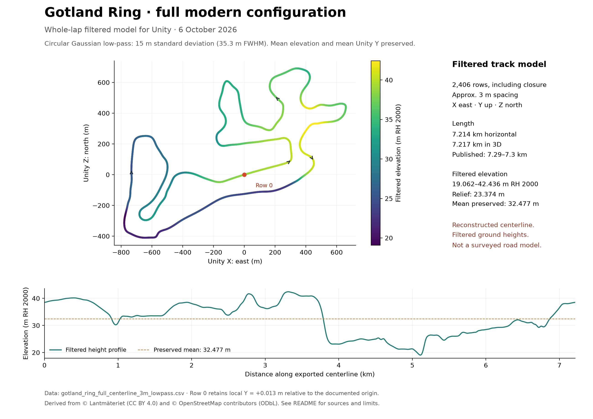

# Gotland Ring / Impreza

**A rally Impreza. A Baltic circuit. An open practice session.**

> **Unofficial fan-made prototype.** This project is not affiliated with, sponsored by, or endorsed by GotlandRing, Subaru Corporation, or their affiliates. GotlandRing, Subaru, Impreza, and other marks mentioned in this project remain the property of their respective owners.

[Download Windows EXE](https://github.com/mannetroll/GotlandRing/releases/download/v0.1.3/GotlandRing-Portable.exe) | [Download macOS ZIP (Apple Silicon)](https://github.com/mannetroll/GotlandRing/releases/download/v0.1.3/GotlandRing-macOS-arm64.zip) | [Release v0.1.3](https://github.com/mannetroll/GotlandRing/releases/tag/v0.1.3)


A small Unity driving prototype inspired by personal photographs and onboard footage of a **Subaru Impreza 2000 GT 2.0 S** at **Gotland Ring**. Drive a CSV-based, approximately 7.214 km circuit through open limestone scenery, in a detailed Impreza rally coupe with a full cockpit.

## Get behind the wheel

**Windows:** download **GotlandRing-Portable.exe**, then double-click it. Windows x64 and working graphics drivers are required. No Unity or .NET installation is needed. The download is approximately **97 MB**.

The first launch extracts the bundled game to `%LOCALAPPDATA%\Mannetroll\GotlandRing\<build hash>`. Later launches reuse those files. Allow about 250 MB for the EXE and extracted runtime. Copy only the portable EXE when moving to another computer. It is unsigned.

**macOS Apple Silicon:** download **GotlandRing-macOS-arm64.zip**, double-click to extract it, then open **GotlandRing.app** inside the extracted folder. Requires macOS **12 or later** and an Apple Silicon Mac (M1 or newer). The Unity runtime is included; no Unity installation is needed. Keep the app, track data and notices together in the extracted folder.

The macOS app is not Developer ID signed or notarized. If macOS blocks it, see [Apple's instructions for opening an app from an unidentified developer](https://support.apple.com/en-us/102445).

| Control | Action |
|---|---|
| W / Up arrow | Accelerate |
| S / Down arrow | Brake |
| A / D or Left / Right arrows | Steer |
| X | Reverse (brakes before changing direction) |
| Ctrl+P (Windows) / Cmd+P (macOS) | Toggle Auto(P)ilot |
| Ctrl+F (Windows) / Cmd+F (macOS) | Toggle fullscreen / restore window size |
| F3 | Configure and save driving dynamics |
| Mouse | Look around in cockpit/bonnet view; orbit the car in chase view |
| Right mouse | Center your view; return behind the car in chase view |
| C | Cycle cockpit / bonnet / chase camera (starts behind the car) |
| R | Recover to the nearest track point, preserving lap time and checkpoint progress |
| Home | Restart the current lap at the start line |
| Escape | Pause / resume and release the mouse |
| T | Cycle paint: Splash red → rally blue → white → Splash red |
| M | Mute / unmute |
| F2 | Save a screenshot alongside the extracted game |

## Inside the prototype

- Imported Impreza rally coupe with textured bodywork, cockpit, roll cage, occupants, steering-wheel animation and rotating/steering road wheels.
- Full circuit loaded from the supplied 3 m centerline CSV, preserving local metre coordinates and terrain elevations.
- Blue-and-white kerbs, limestone runoff, pines, pit wall and wind turbines inspired by the onboard footage.
- 42 numbered name boards on the right side of the circuit, matching the locations in `track/track_points.jpeg` approximately. Boards face approaching drivers and include both names where the map lists alternatives.
- Automatic five-speed transmission, turbo boost, speed-sensitive steering and slower travel off the asphalt.
- Toggleable autopilot with corner-speed planning, advance braking and continuous steering; it uses the same driving physics as the player.
- Speed/RPM/boost display, minimap, live FPS/frame time and checkpoint-gated lap timing.
- Synthesized boxer pulses, turbo lift-off and tire/wind layers, blended with a filtered three-second engine recording from the supplied footage.

## What v0.1.3 is

Refreshed on **6 October 2026** with an Impreza artwork startup splash, fast Auto(P)ilot, a live WASD input display, Ctrl/Cmd+F fullscreen, fixed 16:9 window resizing on both platforms, and updated track validation imagery. Steering response defaults to **5** on Windows and macOS; existing saved configurations remain editable in F3.

A playable first prototype, with simplified geometry and a ground-following bicycle handling model. Track elevations, widths and vehicle response are approximate; this is not a surveyed circuit or calibrated simulator. Scenery collisions, damage, AI opponents and full suspension physics are not implemented. Audio is inspired by the recording rather than an exact exhaust reproduction.

The car model and its textures are [Rally Car by SpatialNeglect (@jeandiz)](https://sketchfab.com/3d-models/rally-car-e0dfd3b6d19947df85002fd8de0a3a02), licensed under [CC BY-NC 4.0](https://creativecommons.org/licenses/by-nc/4.0/). Builds containing this asset are for noncommercial use; the original C# source remains MIT licensed. See [asset credits](docs/ASSET-CREDITS.md).

The original photographs and videos stay outside the repository. The derived engine sample required by the game is included.

## Build it

For a complete setup from a fresh machine, see [Windows 11 setup](Unity_Win11_Setup.md) or [macOS setup](Unity_macOS_Setup.md), including tool downloads, build commands, tests and packaging.

**Game:** Unity **6000.3.25f1 LTS**, Mono, built-in renderer. Windows x64 uses Direct3D 11; macOS ARM64 uses Metal and runs natively on Apple Silicon.
**Windows portable launcher:** .NET **10**, self-contained Windows x64.

Open this folder in Unity. The scene is `Assets/Scenes/Gotland.unity`. The imported car is `Assets/Resources/RallyCar.prefab`; **Gotland Ring > Prepare rally car prefab** regenerates its material assignments, camera anchors and animated pivots. Both build commands run this preparation automatically.

The startup splash uses `Assets/Artwork/ImprezaIcon.png` (the same image as `docs/Splash.png`) on black for at least 2.5 seconds while the game loads, with the Unity logo disabled. Both build targets share these splash settings.

Built games start in a resizable 1600×900 window. Press **Escape** to release the mouse, then drag a window edge or corner to resize it. On both Windows and macOS, the game area keeps its 16:9 aspect ratio while resizing, excluding the title bar and borders. The HUD and driving settings scale with the window. Windows snapping/maximizing also fits a 16:9 game area inside the available space; fullscreen uses the display's resolution.

Press **Ctrl+F** on Windows or **Cmd+F** on macOS, or click the Fullscreen button beside Dynamics, to toggle borderless fullscreen at the display's resolution. Switching back restores the previous window dimensions. This also works while paused or in the settings dialog, preserving the pause and autopilot state. macOS also accepts Ctrl as an alternative to Cmd for the F/P shortcuts.

Other platform differences: macOS uses an Apple Silicon ARM64 app and Metal, while Windows uses an x64 EXE and Direct3D 11. F2/F3 may require Fn on a Mac keyboard. F2 saves images in the macOS application-support folder listed below, or beside the extracted game on Windows. Driving keys, mouse look, cameras, autopilot behaviour and the live WASD display are shared.

### macOS (Apple Silicon)

Install the Apple Silicon edition of Unity **6000.3.25f1** through Unity Hub and activate your Unity license. Run:

```bash
./scripts/Build-macOS.sh
open Build/macOS/GotlandRing.app
```

The script also detects a local editor at `Tools/Unity/6000.3.25f1/Unity.app`. For an editor installed elsewhere, set `UNITY_EDITOR` to the executable:

```bash
UNITY_EDITOR="/path/to/Unity.app/Contents/MacOS/Unity" ./scripts/Build-macOS.sh
```

The build log is `Logs/build-macOS.log`. The output is `Build/macOS/GotlandRing.app`, with track data and attribution files beside it. The app is a local build, without Developer ID signing or notarization. In the editor, select macOS in Build Profiles and use **Gotland Ring > Build macOS Apple Silicon**.

After building and testing, package the app, track data and current notices for download:

```bash
./scripts/Package-macOS.sh
gh release upload v0.1.3 Build/GotlandRing-macOS-arm64.zip
```

The ZIP is built locally on macOS and attached to the release alongside the Windows EXE. The Windows release workflow builds and uploads only the EXE.

F2 screenshots and automated test images on macOS are saved under `~/Library/Application Support/com.Mannetroll-Solutions-AB.Gotland-Ring---Impreza/`. The player log also records each screenshot path. On keyboards that use the function keys for system controls, hold Fn when pressing F2 or F3.

Run the existing standalone checks with graphics enabled:

```bash
open -n -W Build/macOS/GotlandRing.app --args --model-preview -logFile "$PWD/Logs/rally-model-macOS.log"
open -n -W Build/macOS/GotlandRing.app --args --smoke-test -logFile "$PWD/Logs/smoke-macOS.log"
open -n -W Build/macOS/GotlandRing.app --args --settings-test -logFile "$PWD/Logs/settings-macOS.log"
open -n -W Build/macOS/GotlandRing.app --args --sign-test -logFile "$PWD/Logs/signs-macOS.log"
open -n -W Build/macOS/GotlandRing.app --args --autopilot-test -logFile "$PWD/Logs/autopilot-macOS.log"
```

### Windows (x64)

Use **PowerShell 7** for the packaging script and install the **.NET 10 SDK** to build the portable launcher; see the [Windows 11 setup guide](Unity_Win11_Setup.md).

```powershell
& 'C:\Program Files\Unity\Hub\Editor\6000.3.25f1\Editor\Unity.exe' -batchmode -nographics -buildTarget StandaloneWindows64 -projectPath $PWD -executeMethod BuildGame.Build -quit -logFile build.log
```

The game is built to `Build/Windows/GotlandRing.exe`. In the editor, use **Gotland Ring > Build Windows x64**. After rebuilding the game, refresh the embedded Windows payload and publish the launcher:

```powershell
.\scripts\Package-Game.ps1
dotnet publish PortableLauncher\PortableLauncher.csproj -c Release -o dist
```

The release workflow compiles the launcher around the **committed, tested Unity payload** in `PortableLauncher/Game.zip`. It does not rebuild Unity in CI or require a Unity license on the GitHub runner. Regenerate that payload whenever the Unity game changes.

| Location | Purpose |
|---|---|
| `Assets/Scripts/RingDrive.cs` | Circuit, scenery, car, handling, controls and HUD |
| `Assets/Scripts/ImprezaModel.cs` | Imported car steering, wheel animation and cockpit visibility |
| `Assets/Models/RallyCar` | FBX model, textures and materials by SpatialNeglect (CC BY-NC 4.0) |
| `Assets/Editor/RallyCarImport.cs` | Prepare the scaled car prefab and camera/wheel pivots |
| `Assets/Scripts/DrivingSettings.cs` | Saved handling configuration |
| `Assets/Scripts/AutopilotController.cs` | Track curvature, braking envelope and steering/throttle/brake controller |
| `Assets/Scripts/RingDrive.AutopilotChecks.cs` | Full-lap and recovery regression using the game's actual physics |
| `Assets/Scripts/RingDrive.Window.cs` | Ctrl/Cmd shortcuts and fullscreen/window-size restoration |
| `Assets/Scripts/WindowsWindowAspectRatio.cs` / `MacWindowAspectRatio.cs` | Native 16:9 window resizing, excluding the window frame |
| `Assets/Scripts/TrackLandmarks.cs` | Names and approximate CSV positions for the 42 numbered track signs |
| `Assets/Scripts/BoxerAudio.cs` | Responsive engine synthesis and recording layer |
| `Assets/Editor/BuildGame.cs` | Scene generation, Windows x64 and macOS ARM64 builds |
| `scripts/Build-macOS.sh` | Command-line macOS build |
| `scripts/Package-macOS.sh` | macOS release ZIP with app, track data and notices |
| `PortableLauncher/` | Single-file launcher and game payload |
| `.github/workflows/release.yml` | Tagged GitHub release and EXE upload |

## Verification

The current macOS source builds successfully and is installed locally. The imported car and paint colours were rendered and checked. The orbit camera, updated defaults and lap-preserving recovery were compiled without further runtime tests. The full-lap results below used steering response 2; see [verification details](VERIFICATION.md) for coverage.

Windows build and launch passed on the RTX 3090. Five full-track autopilot laps passed across default, low-grip/weak-brake, high-power/slow-steering and saved configurations. With default handling, the best lap was **3:01.12**, top speed **217.9 km/h**, and maximum centreline deviation **1.51 m**. Tests use the actual 100 Hz driving physics, batched between frames; lap times are simulated driving time.

Reverse/off-road recovery, braking, both steering directions and complete track coverage passed. The live WASD display was visually inspected. Windows corner/side/bottom resizing and maximize preserved 16:9; fullscreen restored the previous window dimensions while retaining the settings dialog and pause state. The portable payload was verified against the tested game scripts.

The macOS ARM64/Metal build passed the same five-lap autopilot regression, recovery, driving/braking, settings and 42-sign checks on an Apple M1 Max. Cmd+P toggled autopilot, and Cmd+F entered fullscreen and restored the 1600×900 window while preserving the settings dialog and paused autopilot. See [verification details](VERIFICATION.md).

Steering is tuned for keyboard play: faster turn-in and centering, a wider steering range, and stronger asphalt grip. These are arcade-friendly settings rather than measured Impreza tire limits.

### Driving dynamics

Press **F3**, or click **Dynamics**, to pause and configure cornering grip, side-slip recovery, low/high-speed steering angle, steering response, acceleration, braking and off-road grip. **Apply & close** saves settings locally between launches; **Cancel** discards edits. **Restore defaults** resets the draft until Apply. Steering response ranges from 1 to 9 and defaults to 5 on both Windows and macOS. Existing saved values are preserved; choose Restore defaults and Apply to reset them. Default road cornering grip is now 28 m/s^2 for forgiving arcade handling.

Hold **X** to reverse (maximum approximately 29 km/h). Changing between forward and reverse first brakes the car; S/down remains the brake.

### Auto(P)ilot

Press **Ctrl+P** on Windows or **Cmd+P** on macOS to hand driving to the autopilot. Press the shortcut again, or any driving key (WASD, arrows or X), to take over. Mouse look and camera selection remain available. In chase view, move the mouse to orbit a full 360° around the car at a fixed 5.5 m distance, always looking at its centre. Vertical mouse movement changes the viewing elevation. Right-click returns behind the car, and **C** centres each camera when switching views. Escape pauses driving; the F3 dialog also pauses it and replans speeds when you apply handling changes. Autopilot starts off on each normal launch.

The controller accelerates on straights, plans braking before corners and steers continuously around the complete CSV circuit. Corner speeds respect configured grip and steering limits, with a small allowance for position correction. It follows the centreline, uses the ordinary throttle/brake/steering inputs and attempts to rejoin when engaged off track or facing the wrong way. This is a fast practice driver, not a mathematically optimal racing-line solver; engaging at an excessive speed inside a corner can still run wide. The HUD shows its state, target speed, throttle and brake. A small WASD keyboard lights green for gas, orange for braking and blue for left/right steering; the fill represents input strength, and steering shows the actual applied angle after steering response. Keys go inactive while paused.

Run `Build/Windows/GotlandRing.exe --autopilot-test -logFile Logs/autopilot-windows.log` for the Windows regression. It batches ordinary 0.01-second physics steps between frames: two default laps, laps with low grip/weak brakes and high power/slow steering, a saved-settings lap, and reverse/off-road recovery. It checks full-track coverage, road clearance, acceleration, braking and both steering directions, exits nonzero on failure, and saves `autopilot-test.png`. Test setups do not overwrite saved driving preferences. `--autopilot` starts a normal real-time run with autopilot enabled.

## Visual upgrade in v0.1.3

The current source adds linear lighting, an HDR photographic sky, local sky/circuit reflections, 2K scanned asphalt/grass/gravel with normal maps, 4x MSAA, upgraded car glazing and panel details, and mapped pine woodland. Tree distribution follows the canopy visible in `track/check_*.png` and `track/south_grid.png`; `track/KOENIGSEGG.webm` guides the height and density of the treeline. Northern woodland, southern forest islands and open quarry/paddock areas follow those references. Tree species, heights and individual positions are approximate. Pines use varied, camera-facing cutouts grouped into 96 m tiles for rendering and culling; they are not full 3D trees. See [track documentation](TRACK.md) and [asset credits](docs/ASSET-CREDITS.md).

The car starts in Splash red; **T** cycles through Splash red, rally blue and the supplied white paint. Paint changes cover the body and doors while retaining the gold wheels, glass, lights, interior and texture detail. The rear wing and textured number plate use the supplied model. Steering and road-wheel animation follow the game controls.

The cabin includes a dashboard, racing seats, roll cage and a single driver. Cockpit view hides only the driver’s head and helmet; the arms, body and seatbelts remain visible. Exterior views show the complete driver. The dashboard screen is part of the supplied artwork; current speed, RPM and gear are shown by the game HUD.

## Licensing

Original project software/source code and the bundled engine recording (`Assets/Resources/TrackEngine.wav`) are licensed under the [MIT License](LICENSE), except where another file or notice states otherwise.

Track data and derived geospatial data have separate licensing requirements; see [DATA_LICENSES.md](DATA_LICENSES.md). Third-party and separately licensed assets, the Unity runtime, and the engine recording are documented in [THIRD_PARTY_NOTICES.md](THIRD_PARTY_NOTICES.md).

## CSV track reconstruction



The bundled `Assets/Resources/Track/Centerline.csv` is an unchanged copy of `track/gotland_ring_full_centerline_3m_lowpass.csv`. The importer omits only the duplicate closing position and uses the supplied coordinates directly, without runtime height filtering or horizontal scaling. The 2,405 unique points define approximately 7,214.398 m horizontally / 7,216.638 m in 3D, with 23.374 m elevation variation. The CSV already contains the whole-lap low-pass height profile described in `TRACK.md`. Road width, camber, scenery and surrounding terrain remain approximate. Row zero is an arbitrary origin used as the gameplay start, not a surveyed start/finish line. The minimap preserves the local east/north aspect ratio.

See [CSV documentation](TRACK.md), [validation image](track/gotland_ring_validation.png), and [low-pass elevation profile](track/gotland_ring_whole_lap_lowpass.png) for limitations and provenance. Adapted centerline database: Copyright OpenStreetMap contributors, ODbL 1.0. Data source: Lantmateriet Min karta, Copyright Lantmateriet, CC BY 4.0; processed information. The source CSV and attribution documentation are distributed beside the extracted game.
