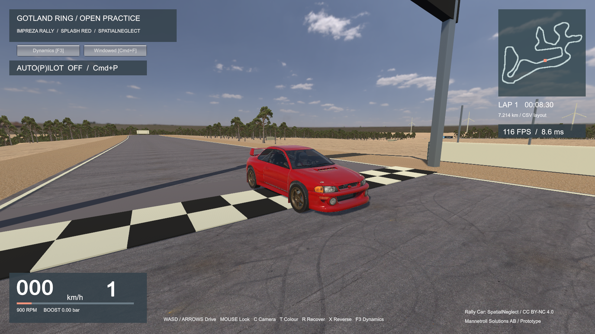
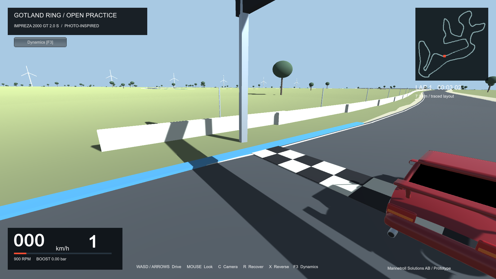
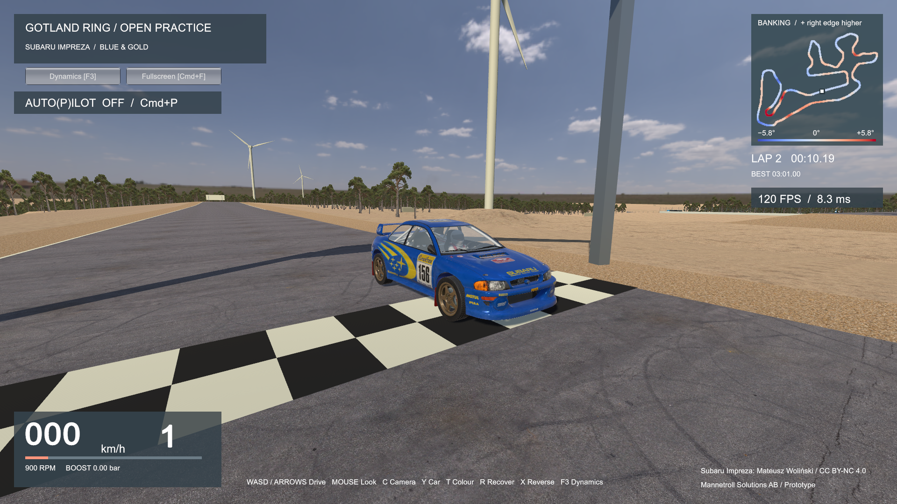

# Gotland Ring / Impreza



| Live cockpit instruments — v0.3.2 | Subaru Impreza — blue-and-gold livery |
|---|---|
|  |  |

[Download the v0.3.2 game lap recording (MKV, 92.1 MB)](docs/Gotland-Ring-Record.mkv)

**A rally Impreza. A Baltic circuit. An open practice session.**

[Download Windows EXE](https://github.com/mannetroll/GotlandRing/releases/download/v0.3.2/GotlandRing-Portable.exe) | [Download macOS ZIP (Apple Silicon)](https://github.com/mannetroll/GotlandRing/releases/download/v0.3.2/GotlandRing-macOS-arm64.zip) | [Release v0.3.2](https://github.com/mannetroll/GotlandRing/releases/tag/v0.3.2)

**Version v0.3.2** includes live cockpit speed, RPM and gear instruments, a steering wheel with animated hands and elbows, subtle cockpit movement, and asphalt/kerb/loose-ground sound. In manual driving, **W/Up always requests forward throttle without applying brakes**, including during spins or when returning from reverse. **F3 → View & sound** adjusts movement and surface sound; zero disables either effect. Both car models and the live reference-lap viewer use the cockpit instruments and animations.

Press **Z** to switch between Gotland Ring and the training pad. Both use the same vehicle physics and settings. **R/Home** resets the car on the pad. Repeated full-throttle steering reversals can break rear grip; lift and countersteer to recover. The chase camera and sideslip display make the car's rotation visible.

Press **U** for mouse steering; **W/Up** and **S/Down** remain the pedals. **Ctrl+P** on Windows or **Cmd+P** on macOS toggles autopilot, which follows the circuit racing line or the pad's large practice circle. **F3** exposes tyre grip, torque split, steering response and the shared **42° low-speed / 19° high-speed** defaults. The **View & sound** tab adjusts cockpit movement and surface sound. **F4** switches between AWD physics and the arcade comparison.

The stock/manual GT baseline has four driven wheels, individual suspension and physical contact with the banked circuit. Its five-speed gearbox shifts automatically. See [physics assumptions and validation](docs/AWD-PHYSICS.md).

> **Unofficial fan-made prototype.** This project is not affiliated with, sponsored by, or endorsed by GotlandRing, Subaru Corporation, or their affiliates. GotlandRing, Subaru, Impreza, and other marks mentioned in this project remain the property of their respective owners.

Two selectable Impreza models. Press **Y** to switch between them during a drive.

A Unity driving prototype inspired by personal photographs and onboard footage of a **Subaru Impreza 2000 GT 2.0 S** at **Gotland Ring**. Drive a CSV-based, approximately 7.214 km circuit through open limestone scenery, choosing between two detailed Impreza models with a shared animated cockpit and driver.

## Get behind the wheel

**Windows:** download **GotlandRing-Portable.exe**, then double-click it. Windows x64 and working graphics drivers are required. No Unity or .NET installation is needed.

The first launch extracts the bundled game to `%LOCALAPPDATA%\Mannetroll\GotlandRing\<build hash>`. Later launches reuse those files. Allow 1 GB for the EXE and extracted runtime. Copy only the portable EXE when moving to another computer. It is unsigned.

**macOS Apple Silicon:** download **GotlandRing-macOS-arm64.zip**, double-click to extract it, then open **GotlandRing.app** inside the extracted folder. Requires macOS **12 or later** and an Apple Silicon Mac (M1 or newer). The Unity runtime is included; no Unity installation is needed. Keep the app, track data and notices together in the extracted folder.

The macOS app is not Developer ID signed or notarized. If macOS blocks it, see [Apple's instructions for opening an app from an unidentified developer](https://support.apple.com/en-us/102445).

| Control | Action |
|---|---|
| W / Up arrow | Accelerate |
| S / Down arrow | Brake |
| A / D or Left / Right arrows | Steer in keyboard mode |
| U | Toggle mouse / keyboard steering |
| Z | Switch Gotland Ring / asphalt training area, stopping at the start |
| X | Reverse (brakes before changing direction) |
| Ctrl+P (Windows) / Cmd+P (macOS) | Toggle Auto(P)ilot |
| Ctrl+F (Windows) / Cmd+F (macOS) | Toggle fullscreen / restore window size |
| F3 | Configure and save driving dynamics |
| F4 | Switch AWD / arcade handling and restart the lap |
| Mouse | Horizontal steering in mouse mode; camera look/orbit in keyboard mode |
| Right mouse | Centre steering in mouse mode; centre the view in keyboard mode |
| C | Cycle cockpit / bonnet / chase camera (starts behind the car) |
| Y | Switch between Impreza Rally and the blue-and-gold Subaru Impreza, preserving the current drive |
| O | Watch / leave the game-rendered Sadair’s Spear reference lap |
| R | Recover to the nearest circuit point; reset to the start on the training pad |
| Home | Restart the lap, or reset to the training start line |
| Escape | Pause / resume and release the mouse |
| T | Cycle Impreza Rally paint: Splash red → rally blue → white → Splash red |
| M | Mute / unmute |
| F2 | Save a screenshot alongside the extracted game |

## Inside the prototype

- Imported Impreza rally coupe with textured bodywork, cockpit, roll cage, a single driver, steering-wheel animation and rotating/steering road wheels.
- A second Subaru Impreza from the supplied `subaru_impreza.glb`, retaining its blue-and-gold livery. **Y** switches car visuals without resetting position, speed, lap timing, camera or autopilot; the second car shares the detailed cockpit and driver.
- Full circuit loaded from the supplied 3 m surface CSV, preserving the centerline and adding estimated widths, banking and crown/hollow profiles.
- Limestone aprons, white edge markings, pines, pit wall and 12 wind turbines at the supplied registry coordinates and terrain elevations. Six V47s have 55 m hubs / 47 m rotors, three V66s have 78 m hubs / 66 m rotors, and three V90s have 105 m hubs / 90 m rotors. Rotors face **W (west)** and turn clockwise from the front at **10 RPM**, using a visual estimate from the 2022 recording, and stop while paused.
- 42 numbered name boards on the right side of the circuit, matching the locations in `track/track_points.jpeg` approximately. Boards face approaching drivers and include both names where the map lists alternatives.
- Map-positioned limestone quarry banks give the approaches to Månen and Havsörnen their raised, exposed silhouettes. Their heights are estimated from the onboard reference.
- The main building and annex sit north of mapped turbine 2. Mesh catch fencing, Armco rails and concrete barriers follow the styles in the owner's 2022 film; see [scenery references](docs/SCENERY.md).
- Automatic five-speed transmission, turbo boost, speed-sensitive steering and slower travel off the asphalt.
- Toggleable autopilot with an optimized racing line, corner-speed planning, advance braking and continuous steering; it uses the same driving physics as the player.
- Live reference-lap viewer with bonnet and cockpit views, reference clock and estimated Impreza engine sound. **O** starts the viewer and returns to the saved drive.
- Speed/RPM/boost display, minimap, live FPS/frame time and checkpoint-gated lap timing.
- Engine audio isolated from the owner's 2022 Impreza recording, with speech removed through engine-cycle extraction, RPM-matched playback, throttle-dependent intake tone, lift-off and speed-dependent wind noise, plus wheel-contact asphalt, kerb and loose-ground sound.

## Driving environment

The circuit uses the supplied surface reconstruction for variable asphalt widths, banking and crown/hollow profiles. Road rendering, car contact and recovery share the same surface; driving physics and autopilot account for banking. White edge markings follow the supplied boundary confidence, and scenery heights follow the new surface. Banking ranges from −4.835° to +5.778° in the estimated data. The mini-map matches the surface validation image's blue–gray–red banking scale: blue is negative, gray is zero, and red is positive (right edge higher). Its degree legend uses symmetric limits of ±5.8°, a white marker shows your car, and a chequered marker locates the start/finish on Gutemålrakan.

The detailed Impreza starts in red with a rear chase camera. **T** cycles its paint; mouse movement orbits the car in chase view. Cockpit view keeps the driver’s arms and body visible, and **R** recovery preserves lap timing. The circuit includes **10,595 pine trees** distributed from the supplied aerial references. AWD steering speed defaults to **90 degrees/s**, with speed-sensitive keyboard input. Arcade response defaults to **5**. Both are editable in F3.

A playable prototype with force-based AWD handling and a selectable arcade bicycle model. AWD has individual tyre contacts, springs, dampers and anti-roll forces. Track elevations, widths and vehicle response are approximate; this is not a surveyed circuit or calibrated simulator. Complete scenery collisions, damage and AI opponents are not implemented. Audio uses engine-cycle waveforms extracted from the real in-car recording; idle and RPM outside the recorded ranges are pitch-derived.

The car models and textures are [Rally Car by SpatialNeglect (@jeandiz)](https://sketchfab.com/3d-models/rally-car-e0dfd3b6d19947df85002fd8de0a3a02) and [Subaru Impreza by Mateusz Woliński (@jeandiz)](https://sketchfab.com/3d-models/subaru-impreza-7fb4298d5d8f4185b25bb2c43d7f3787), licensed under [CC BY-NC 4.0](https://creativecommons.org/licenses/by-nc/4.0/). Builds containing these assets are for noncommercial use; the original C# source remains MIT licensed. See [asset credits](docs/ASSET-CREDITS.md).

The repository includes track reference images. The [full-lap reference video is available on YouTube](https://youtu.be/fSb8Rx1OKHI). Source recordings in `unstaged/` and `sound/` stay local and are excluded from Git. Builds include the prepared car assets, derived scenery and isolated engine waveforms; the source films are not needed to build or run the game and are not bundled in either download.

## Build it

For a complete setup from a fresh machine, see [Windows 11 setup](Unity_Win11_Setup.md) or [macOS setup](Unity_macOS_Setup.md), including tool downloads, build commands, tests and packaging.

**Game:** Unity **6000.3.25f1 LTS**, Mono, built-in renderer. Windows x64 uses Direct3D 11; macOS ARM64 uses Metal and runs natively on Apple Silicon.
**Windows portable launcher:** .NET **10**, self-contained Windows x64.

Open this folder in Unity. The scene is `Assets/Scenes/Gotland.unity`. The cars are `Assets/Resources/RallyCar.prefab` and `Assets/Resources/SubaruImpreza.prefab`. The **Gotland Ring > Prepare rally car prefab** and **Prepare Subaru Impreza prefab** editor commands regenerate materials, camera anchors and animated pivots. Both build commands prepare both cars automatically.

The second model's prepared FBX and textures are in `Assets/Models/SubaruImpreza/`. To regenerate them from the supplied `Impreza/subaru_impreza.glb`, run `python3 scripts/Prepare-Subaru.py` with Assimp and ffmpeg installed. Normal builds use the prepared assets and do not require those tools or the original GLB.

The startup splash uses `Assets/Artwork/ImprezaIcon.png` (the same image as `docs/Splash.png`) on black for at least 2.5 seconds while the game loads, with the Unity logo disabled. Both build targets share these splash settings.

Built games start in a resizable 1600×900 window. Press **Escape** to release the mouse, then drag a window edge or corner to resize it. On both Windows and macOS, the game area keeps its 16:9 aspect ratio while resizing, excluding the title bar and borders. The HUD and driving settings scale with the window. Windows snapping/maximizing also fits a 16:9 game area inside the available space; fullscreen uses the display's resolution.

Press **Ctrl+F** on Windows or **Cmd+F** on macOS, or click the Fullscreen button beside Dynamics, to toggle borderless fullscreen at the display's resolution. Switching back restores the previous window dimensions. This also works while paused or in the settings dialog, preserving the pause and autopilot state. macOS also accepts Ctrl as an alternative to Cmd for the F/P shortcuts.

Other platform differences: macOS uses an Apple Silicon ARM64 app and Metal, while Windows uses an x64 EXE and Direct3D 11. F2/F3/F4 may require Fn on a Mac keyboard. **Home** is **Fn + Left arrow** on compact Mac keyboards. F2 saves images in the macOS application-support folder listed below, or beside the extracted game on Windows. Driving keys, mouse look, cameras, autopilot behaviour and the live WASD display are shared.

### macOS (Apple Silicon)

Install the Apple Silicon edition of Unity **6000.3.25f1** through Unity Hub and activate your Unity license. Run:

```bash
./scripts/Build-macOS.sh
open Build/macOS/GotlandRing.app
```

The script also detects a local editor at `Tools/Unity/6000.3.25f1/Unity.app`. For an editor installed elsewhere, set `UNITY_EDITOR` to the executable:

```bash
UNITY_EDITOR="/path/to/Unity.app/Contents/MacOS/Unity" ./scripts/Build-macOS.sh
```

The build log is `Logs/build-macOS.log`. The output is `Build/macOS/GotlandRing.app`, with track data and attribution files beside it. The app is a local build, without Developer ID signing or notarization. In the editor, select macOS in Build Profiles and use **Gotland Ring > Build macOS Apple Silicon**.

After building and testing, package the app, track data and current notices for download:

```bash
./scripts/Package-macOS.sh
gh release upload v0.3.2 Build/GotlandRing-macOS-arm64.zip
```

Both packages are built and tested before upload. The release workflow verifies the published downloads against `SHA256SUMS`.

F2 screenshots and automated test images on macOS are saved under `~/Library/Application Support/com.Mannetroll-Solutions-AB.Gotland-Ring---Impreza/`. The player log also records each screenshot path. On keyboards that use the function keys for system controls, hold Fn when pressing F2, F3 or F4.

Run the existing standalone checks with graphics enabled:

```bash
open -n -W Build/macOS/GotlandRing.app --args --instruments-test -logFile "$PWD/Logs/instruments-macOS.log"
open -n -W Build/macOS/GotlandRing.app --args --feedback-test -logFile "$PWD/Logs/feedback-macOS.log"
open -n -W Build/macOS/GotlandRing.app --args --model-preview -logFile "$PWD/Logs/rally-model-macOS.log"
open -n -W Build/macOS/GotlandRing.app --args --car-switch-test -logFile "$PWD/Logs/car-switch-macOS.log"
open -n -W Build/macOS/GotlandRing.app --args --wind-test -logFile "$PWD/Logs/wind-macOS.log"
open -n -W Build/macOS/GotlandRing.app --args --scenery-test -logFile "$PWD/Logs/scenery-macOS.log"
open -n -W Build/macOS/GotlandRing.app --args --surface-test -logFile "$PWD/Logs/surface-macOS.log"
open -n -W Build/macOS/GotlandRing.app --args --smoke-test -logFile "$PWD/Logs/smoke-macOS.log"
open -n -W Build/macOS/GotlandRing.app --args --settings-test -logFile "$PWD/Logs/settings-macOS.log"
open -n -W Build/macOS/GotlandRing.app --args --sign-test -logFile "$PWD/Logs/signs-macOS.log"
open -n -W Build/macOS/GotlandRing.app --args --autopilot-test -logFile "$PWD/Logs/autopilot-macOS.log"
```

### Windows (x64)

Use **PowerShell 7** for the packaging script and install the **.NET 10 SDK** to build the portable launcher; see the [Windows 11 setup guide](Unity_Win11_Setup.md).

```powershell
& 'C:\Program Files\Unity\Hub\Editor\6000.3.25f1\Editor\Unity.exe' -batchmode -nographics -buildTarget StandaloneWindows64 -projectPath $PWD -executeMethod BuildGame.Build -quit -logFile build.log
```

The game is built to `Build/Windows/GotlandRing.exe`. In the editor, use **Gotland Ring > Build Windows x64**. After rebuilding the game, refresh the embedded Windows payload and publish the launcher:

```powershell
.\scripts\Package-Game.ps1
dotnet publish PortableLauncher\PortableLauncher.csproj -c Release -o Build/Portable
```

`PortableLauncher/Game.zip` is a generated, Git-ignored build payload. Rebuild Unity and regenerate it before publishing the launcher. GitHub releases contain the tested Windows EXE, macOS ZIP and `SHA256SUMS`; pushing a tag alone does not upload binaries.

### Publish a release

Set the displayed version, including its `v` prefix, in `Assets/Editor/BuildGame.cs`, `ProjectSettings/ProjectSettings.asset` and the launcher’s `InformationalVersion` in `PortableLauncher/PortableLauncher.csproj`. Keep the launcher’s numeric `Version` without the prefix for .NET build metadata. Update the download links and `docs/release-notes.md`. Build and run the checks above for both targets, then package the macOS app and Windows portable launcher. Windows builds can use the Mac editor’s Windows Build Support; run the resulting EXE and package checks on Windows.

After copying the tested Windows portable EXE into `Build/Portable/` on the Mac:

```bash
./scripts/Package-macOS.sh
(cd Build && shasum -a 256 Portable/GotlandRing-Portable.exe GotlandRing-macOS-arm64.zip) | sed 's|Portable/||' > Build/SHA256SUMS
git add Assets/Editor/BuildGame.cs ProjectSettings/ProjectSettings.asset PortableLauncher/PortableLauncher.csproj README.md docs/release-notes.md VERIFICATION.md
git commit -m "Release v0.3.2"
git tag -a v0.3.2 -m "Gotland Ring v0.3.2"
git push origin main v0.3.2
gh release create v0.3.2 --verify-tag --draft --title "Gotland Ring v0.3.2" --notes-file docs/release-notes.md Build/Portable/GotlandRing-Portable.exe Build/GotlandRing-macOS-arm64.zip Build/SHA256SUMS
```

Check that both uploaded packages match the local checksums, then publish with `gh release edit v0.3.2 --draft=false --latest`. The release workflow downloads both packages and verifies their checksums. Game binaries stay in release assets, outside Git.

| Location | Purpose |
|---|---|
| `Assets/Scripts/RingDrive.cs` | Circuit, scenery, car, handling, controls and HUD |
| `Assets/Scripts/TrackData.cs` / `RingDrive.Surface.cs` | Banked road mesh, matching surface queries, variable asphalt edges and car alignment |
| `Assets/Scripts/RingDrive.SurfaceChecks.cs` | Forward/reverse ground contact, bank direction, recovery and seam checks |
| `windmills/` / `Assets/Resources/Track/WindTurbines.csv` | Supplied registry positions, model dimensions and RH2000 base heights; the bundled CSV is unchanged |
| `Assets/Scripts/RingDrive.WindTurbines.cs` / `WindTurbineData.cs` | Registered turbine placement, scaled procedural geometry and rotor animation |
| `Assets/Scripts/CockpitInstruments.cs` / `Assets/Resources/Visuals/CockpitInstruments.shader` | Live in-car speed, RPM bar, numeric RPM and gear |
| `Assets/Scripts/ImprezaModel.cs` | Imported car steering, driver arms, wheel animation and cockpit visibility |
| `Assets/Models/RallyCar` | FBX model, textures and materials by SpatialNeglect (CC BY-NC 4.0) |
| `Assets/Editor/RallyCarImport.cs` | Prepare the scaled car prefab and camera/wheel pivots |
| `Assets/Editor/SubaruCarImport.cs` | Prepare the second car's exterior, materials, wheel pivots and shared cockpit |
| `Assets/Scripts/DrivingSettings.cs` | Saved handling configuration |
| `Assets/Scripts/AutopilotController.cs` | Track curvature, braking envelope and steering/throttle/brake controller |
| `Assets/Scripts/RingDrive.AutopilotChecks.cs` | Arcade full-lap and recovery regression |
| `Assets/Scripts/SubaruAwdController.cs` | Four-wheel tyre, suspension, AWD and drivetrain forces |
| `Assets/Scripts/SubaruVehicleSetup.cs` | Stock GT baseline and documented tuning assumptions |
| `Assets/Scripts/RingDrive.AwdChecks.cs` | Physical contact, controls, straight-line and full-lap checks |
| `Assets/Scripts/RingDrive.Window.cs` | Ctrl/Cmd shortcuts and fullscreen/window-size restoration |
| `Assets/Scripts/WindowsWindowAspectRatio.cs` / `MacWindowAspectRatio.cs` | Native 16:9 window resizing, excluding the window frame |
| `Assets/Scripts/TrackLandmarks.cs` | Names and approximate CSV positions for the 42 numbered track signs |
| `Assets/Scripts/ReferenceLapPlayer.cs` / `RingDrive.ReferenceLap.cs` | Live reference-lap rendering, split views, clock, sound and driving-state restoration |
| `Assets/Scripts/BoxerAudio.cs` / `ImprezaEngineMixer.cs` / `SurfaceAudioMixer.cs` | Recorded Impreza loops, RPM blending and procedural surface audio |
| `Assets/Scripts/RideFeedback.cs` / `RingDrive.Feedback.cs` | Inertial cockpit movement, wheel-contact surface cues and view/sound settings |
| `scripts/Prepare-EngineAudio.py` | Reproduce engine loops from the owner's 2022 recording |
| `Assets/Editor/BuildGame.cs` | Scene generation, Windows x64 and macOS ARM64 builds |
| `scripts/Build-macOS.sh` | Command-line macOS build |
| `scripts/Package-macOS.sh` | macOS release ZIP with app, track data and notices |
| `PortableLauncher/` | Single-file launcher and game payload |
| `.github/workflows/release.yml` | Published release checksums and macOS ZIP integrity |

## Lines of code

Source snapshot for **10 October 2026**: **5,082 code lines across 70 files**. LOC counts physical lines containing code, excluding blank lines, comment-only lines, Python docstrings and script shebangs. Braces and compiler directives count as code; multiple statements on one line count once. The comment column includes Python docstrings and script shebangs; the table accounts for **5,456 physical lines** in total.

| Source | Language | Files | Code LOC | Comment lines | Blank lines |
|---|---|---:|---:|---:|---:|
| Game and runtime checks (`Assets/Scripts/*.cs`) | C# | 48 | 3,904 | 106 | 164 |
| Unity editor, importers and build checks (`Assets/Editor/*.cs`) | C# | 10 | 719 | 19 | 23 |
| Windows portable launcher (`PortableLauncher/Program.cs`) | C# | 1 | 45 | 0 | 2 |
| Rendering shaders (`Assets/Resources/Visuals/*.shader`) | ShaderLab with Cg/HLSL | 5 | 166 | 1 | 0 |
| Asset preparation and audio regression (`scripts/*.py`) | Python | 3 | 188 | 23 | 26 |
| macOS build and packaging (`scripts/*.sh`) | Bash | 2 | 45 | 2 | 8 |
| Windows packaging (`scripts/*.ps1`) | PowerShell | 1 | 15 | 0 | 0 |
| **Total** | | **70** | **5,082** | **151** | **223** |

The count covers game source, verification code and build/asset tools. It excludes Unity and package dependencies, generated files, third-party assets, track data, serialized scenes/prefabs, project/CI configuration and documentation. The reference importer at `track/Unity6/Editor/GotlandRingImporter.cs` is also excluded because it is outside the game's compiled `Assets` tree.

## Verification

`--instruments-test` checks live AWD/arcade data, both cockpit displays, sliding speed, reverse, pause and model isolation. It renders the LCD on the GPU to check changing speed/RPM digits and rev-bar fill, and saves cockpit screenshots. `--reference-lap-test` also checks the display after replay seeks, pause and completion.

`--feedback-test` checks live AWD road/shoulder/airborne contacts, acceleration,
view/sound controls, mouse look, chase view and recovery. Unity builds also check
all 26 kerb runs against the surface classifier, inertial movement direction and
bounds, frame-rate consistency, stationary/airborne settling and audio headroom
at 44.1/48/96 kHz. `--settings-test` covers Apply/Cancel and persistence for both
tabs; `--reference-lap-test` includes the replay's movement, pause and seek.

`--reference-lap-test` checks the complete replay alignment, audio control ranges,
clock boundaries, pause/mute/completion, circuit/training and AWD/arcade state
restoration, lap-time isolation, camera layout and cleanup. It saves
`reference-lap-arho.png` in the game screenshot folder and exits nonzero on failure.

The AWD integration builds on Unity **6000.3.25f1**. The macOS full-lap check
starts on Gutemålrakan and covers all **2,405** track segments in **4:15.61**, with maximum speed **181.7 km/h**
and **20 downshifts under power**. At more than 43 km/h, peak body sideslip is
**8.62°**, with about **91.59 seconds** above 3° in corners. All four corners of
the car remain on the asphalt; minimum measured body clearance is **0.44 m**.
Main-straight 0–100 km/h takes **7.27 s**, followed by a **35.79 m** stop.
On the flat pad, sustained full-throttle reversals at 100/140 km/h produce
about **37°/54°** peak body sideslip. Lifting and countersteering recovers a
20° slide. Both areas use the same AWD physics. These are prototype measurements.

The AWD checks also cover progressive tyre force, **24 manual steering recovery
cases at 60/100/140 km/h**, eight full-throttle reversal runs and four
countersteering recoveries on the flat training pad, 20 accelerator-held spins past 90° across both areas and handling modes, deliberate direction changes, mesh contact, banking, reverse, braking, pause and
model/mode switching. Training checks exercise both handling modes with manual
and automatic driving, paused switching, recovery, circuit return and lap
isolation. The arcade regression covers five laps and recovery. See
[physics assumptions and reproduction commands](docs/AWD-PHYSICS.md).

### Driving dynamics

Press **F3**, or click **Dynamics**, to pause and choose a handling mode.
AWD exposes tyre grip, front torque share, steering speed and traction control.
Both modes share **Low-speed steering (degrees)** and **High-speed steering
(degrees)**, defaulting to **42°** and **19°**. The ranges are **25–55°** and
**8–25°**. Steering blends smoothly between the two values from rest to
**234 km/h**, with the high-speed value used above that speed. Keyboard, mouse,
autopilot and visible front wheels all use the configured angles.
Arcade exposes cornering grip, side-slip recovery, steering, acceleration,
braking and off-road grip. The **View & sound** tab offers **Cockpit movement**
(default 50%) and **Surface sound** (default 65%). Set either to zero to disable
that effect. Engine sound has its usual **M** mute control. **Apply & close** saves locally; **Cancel** discards
edits. **Restore defaults** resets the draft to the stock AWD setup until Apply.
Press **F4** outside the dialog to switch modes directly. Switching modes
restarts the lap and clears its best time. The mode is shown on the speed HUD.

Cockpit movement follows acceleration, braking and lateral acceleration, with a
small vibration from the ground under each wheel. The bonnet view uses a quarter
of the road vibration; chase view stays steady. Road hum, kerb rumble and loose
ground have separate procedural sounds, mixed by wheel contact and speed. AWD
airborne wheels contribute no surface sound or road vibration. Arcade and the
reference replay use their wheel positions on the ground. Recovery and replay
seeking reset head movement; pause freezes it. These are approximate view and
sound cues: they do not change grip, suspension forces or the racing line.


In manual driving, **W/Up** always requests forward throttle, including during spins and while moving backwards in reverse. It never applies the brakes, and takes priority over X if both are held. **S/Down** is the brake. Hold **X** to reverse (maximum approximately 29 km/h); X brakes forward motion before engaging reverse. Movement alone does not select reverse or apply the brakes.

### Mouse steering

Press **U**, or click the **Steering** button while paused, to switch steering
input. Keyboard mode is the default on each launch. In mouse mode, moving left
or right adjusts and holds the steering position; move back to straighten or
right-click to centre. The indicator shows the requested steering position.
Vertical motion does nothing. **W/Up** accelerates, **S/Down** brakes and **X**
reverses in either mode; mouse movement and buttons do not operate the pedals.
A/D and the left/right arrows are ignored while mouse steering is selected.

Mouse mode keeps the camera centred; **C** still changes views. Toggle **U** back
to keyboard mode to use mouse look/orbit. Both inputs use the same steering
response and speed-dependent AWD range. Pausing, recovery, a focus change or
an autopilot handover centres mouse steering. Autopilot remains in charge until
**Ctrl+P** (Windows) or **Cmd+P** (macOS) is pressed.

### Reference lap viewer

Press **O** to watch the game-rendered lap matched to the
[Koenigsegg Sadair’s Spear onboard reference](https://youtu.be/fSb8Rx1OKHI).
It shows the bonnet above a cockpit inset and a lap clock, using the same
alignment as the comparison video. **O** returns to your drive; **Space** or
**Escape** pauses/resumes playback; **Home** restarts it; **M** toggles sound.
Fullscreen and F2 screenshots remain available. Playback holds at the end.

The 3:06 sequence includes the approach and a **2:55.88 reference lap**.
Your drive is paused while watching, preserving position, momentum, handling
mode, selected car, autopilot and lap progress. Viewing time is excluded from
your driving lap. The viewer renders the circuit live; it does not play or
export an MP4 and does not require a video encoder or the source footage.

`Assets/Resources/Replay/ReferenceLap.json` contains the 24 Hz distance
alignment and estimated engine controls prepared for the comparison. The
sound uses the game's Impreza mixer, with earlier downshifts and rev-matching
blips and the configured view/surface effects. The motion and clock reproduce approximate reference
progress, not a Subaru physics lap or measured vehicle telemetry. Rendering
uses the current game scenery and a separate red rally-car visual, so returning
from the viewer leaves your selected driving car intact.

### Auto(P)ilot

Press **Ctrl+P** on Windows or **Cmd+P** on macOS to hand driving to the autopilot. Press the shortcut again to return to manual driving. WASD, arrows and X are ignored while autopilot is on. Camera selection remains available. In keyboard steering mode, the mouse controls camera look; in mouse steering mode it waits for manual driving and does not override autopilot. In chase view, move the mouse to orbit a full 360° around the car at a fixed 5.5 m distance, always looking at its centre. Vertical mouse movement changes the viewing elevation. Right-click returns behind the car, and **C** centres each camera when switching views. Escape pauses driving; the F3 dialog also pauses it and replans speeds when you apply handling changes. Autopilot starts off on each normal launch.

Arcade gravel resistance rises with speed, allowing manual and autopilot pull-away from the runoff.

The controller computes a smooth racing line around the complete circuit, using wider entries and exits and moving toward the apex through bends. It minimizes changes in direction within the supplied asymmetric asphalt boundaries, reserving 2.6 m from the planned car centre to each edge for body width and steering corrections. The line closes smoothly across the start/finish. This is a practical curvature optimization; it does not establish a global minimum lap time.

Corner speeds use the racing line's curvature and local banking, configured grip, steering angle and steering response. Braking is planned ahead along the same line. The controller uses ordinary throttle/brake/steering inputs and rejoins the racing line when engaged off track or facing the wrong way. Engaging at an excessive speed inside a corner can still run wide. The HUD shows its state, target speed, throttle and brake. A small WASD keyboard lights green for gas, orange for braking and blue for left/right steering; the fill represents input strength, and steering shows the actual applied angle after steering response. Keys go inactive while paused.

Run `Build/Windows/GotlandRing.exe --autopilot-test -logFile Logs/autopilot-windows.log` for the Windows regression. It batches ordinary 0.01-second physics steps between frames: two default laps, laps with low grip/weak brakes and high power/slow steering, a saved-settings lap, and reverse/off-road recovery. It checks line curvature, use of track width, full-track coverage, car-body clearance, acceleration, braking and both steering directions. It exits nonzero on failure and saves `autopilot-test.png` and the planned `racing-line.csv` in the application's screenshot folder. Test setups do not overwrite saved driving preferences. `--autopilot` starts a normal real-time run with autopilot enabled.

## Visuals

The current source adds linear lighting, an HDR photographic sky, local sky/circuit reflections, 2K scanned asphalt/grass/gravel with normal maps, 4x MSAA, upgraded car glazing and panel details, and mapped pine woodland. Tree distribution follows the canopy visible in `track/check_*.png` and `track/south_grid.png`; the [YouTube reference video](https://youtu.be/fSb8Rx1OKHI) guides the height and density of the treeline. Northern woodland, southern forest islands and open quarry/paddock areas follow those references. Tree species, heights and individual positions are approximate. Pines use varied, camera-facing cutouts grouped into 96 m tiles for rendering and culling; they are not full 3D trees. See [track documentation](TRACK.md) and [asset credits](docs/ASSET-CREDITS.md).

Turbines use `windmills/gotland_ring_wind_turbines.csv` directly in the track's metre-based coordinate frame, without another offset or terrain snap. The fixed Y origin is 38.507350922 m RH2000. Base positions, hub heights and rotor diameters come from the supplied export. The scene uses a west-facing rotor front (−X), corresponding to wind arriving from W and flowing east (+X), with clockwise rotation at 10 RPM. These are visual estimates from `Gotland Ring 2022 - 1 of 1.mp4`: west is the selected coarse cardinal match from the film/layout comparison, and the blade motion around 02:39–02:41 supports roughly 10 RPM. The bearing is less certain than the rotation rate; neither is calibrated telemetry or a registry field. All turbines share this scene setting. Tower/blade shapes, blade phases and local ground transitions are also visual approximations. Ground transitions connect the supplied base heights to the game's approximate landscape and avoid the road/aprons. They are not additional terrain measurements. Registry position accuracy is unspecified, and ground heights are terrain-model estimates. See [turbine import notes](windmills/WIND_TURBINES_README.txt) and the [location map](windmills/gotland_ring_wind_turbines_map.png).

The car starts in Splash red; **T** cycles through Splash red, rally blue and the supplied white paint. Paint changes cover the body and doors while retaining the gold wheels, glass, lights, interior and texture detail. The rear wing and textured number plate use the supplied model. The cockpit steering wheel follows the actual front-wheel angle with a fixed visual 12:1 ratio (504° at the default 42° low-speed lock). The speed-dependent steering limits therefore reduce cockpit rotation too. Both car models, manual driving, autopilot and reference replay share this animation; the ratio is a visual approximation, not a measured steering-rack specification. The driver’s hands follow the rim with bending elbows and alternating regrips at large steering angles. The seated torso stays fixed; pause and replay seeks preserve the steering pose. Road wheels follow steering and vehicle speed.

The cabin includes a dashboard, racing seats, roll cage and a single driver. Cockpit view hides only the driver’s head and helmet; the arms, body and seatbelts remain visible. Exterior views show the complete driver. The cockpit LCD shows live speed in km/h, numeric RPM, a segmented rev bar and the current gear (R in reverse), using the same values as the HUD. Both models update immediately when switching cars or pausing. The reference viewer uses its estimated speed, RPM and gear, including when seeking.

## Licensing

Original project software/source code and the bundled engine recordings (`Assets/Resources/Audio/Impreza*.wav`) are licensed under the [MIT License](LICENSE), except where another file or notice states otherwise.

Track data and derived geospatial data have separate licensing requirements; see [DATA_LICENSES.md](DATA_LICENSES.md). Third-party and separately licensed assets, the Unity runtime, and the engine recording are documented in [THIRD_PARTY_NOTICES.md](THIRD_PARTY_NOTICES.md).

## CSV track reconstruction


The bundled `Assets/Resources/Track/Surface.csv` is an unchanged copy of `track/gotland_ring_full_surface_3m.csv`. Its first 12 columns preserve `track/gotland_ring_full_centerline_3m_lowpass.csv` exactly. The 2,405 unique positions define approximately 7,214.397 m horizontally / 7,216.638 m in 3D, with 23.374 m elevation variation. No additional height filter or horizontal scaling is applied. The mesh repeats the first cross-section to close the lap, while navigation omits that duplicate. The start/finish, spawn and lap timing use point 284 (852 m) on Gutemålrakan, approximately matched to the reference footage. Row zero remains the CSV coordinate origin.

The road uses the supplied asymmetric widths (10.535–17.125 m total), cross-slope and quadratic crown/hollow profile, with 16 subdivisions across the asphalt. Estimated edge-to-edge banking ranges from −4.835° to +5.778°; positive banking raises the right edge. Banking is already encoded in the surface heights and is not applied as a second rotation. Three-metre aprons follow the supplied ground height differences; the broader grass shoulders remain an approximate connection to the existing terrain. White paint follows accepted boundary estimates, with gaps at inferred boundaries. Twenty-six black-and-white kerb strips follow the corners and exits visible in the comparison footage, including Arho (41). Their placement and dimensions are visual estimates; they follow the existing ground without adding unmeasured raised collision profiles. See [scenery notes](docs/SCENERY.md).

AWD wheel contacts use the rendered track mesh, with gravity and individual suspension determining body height, pitch and roll. The arcade comparison follows the surface directly and includes banking in its cornering limit. Both modes classify asphalt/off-road from the same data and have their own autopilot speed budgets. Tyre behaviour remains approximate. The estimated surface does not establish surveyed banking or reproduce the historical 10° claim. See [surface data and limitations](track/SURFACE_README.md) and [surface validation](track/gotland_ring_surface_validation.png).

Run `--surface-test` on either standalone player to check banked ground contact, forward/reverse orientation, recovery and the lap seam. On macOS:

```bash
open -n -W Build/macOS/GotlandRing.app --args --surface-test -logFile "$PWD/Logs/surface-macOS.log"
```

See [CSV documentation](TRACK.md), [validation image](track/gotland_ring_validation.png), and [low-pass elevation profile](track/gotland_ring_whole_lap_lowpass.png) for limitations and provenance. Adapted centerline database: Copyright OpenStreetMap contributors, ODbL 1.0. Data source: Lantmateriet Min karta, Copyright Lantmateriet, CC BY 4.0; processed information. The source CSV and attribution documentation are distributed beside the extracted game.
